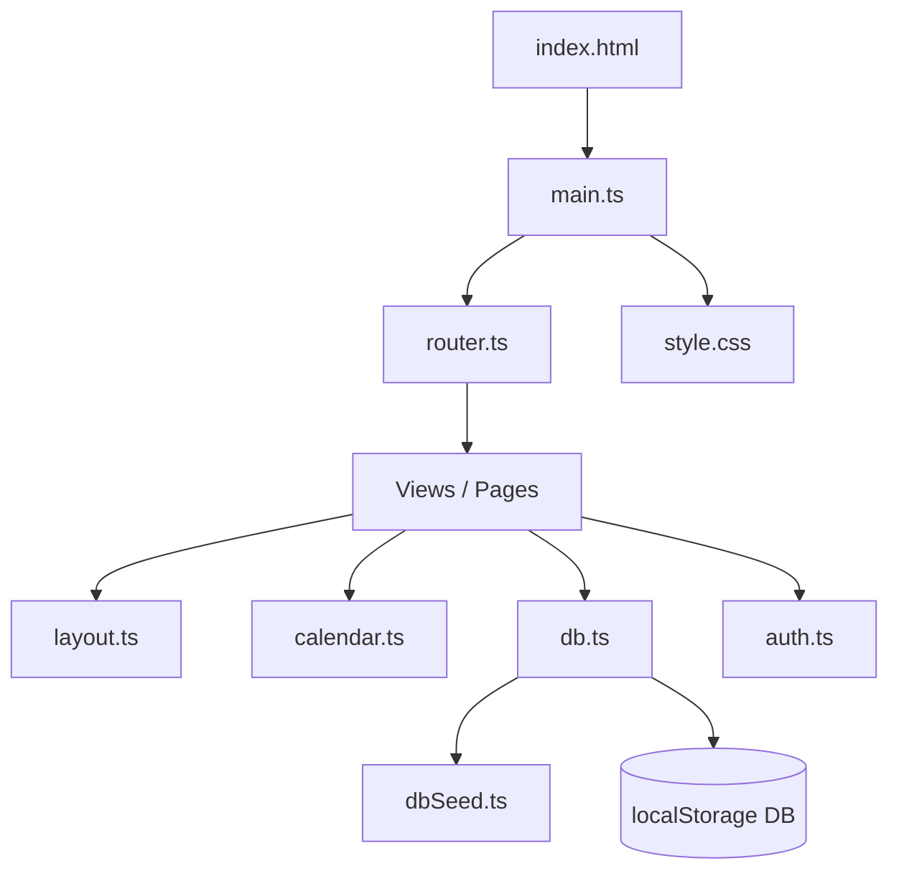
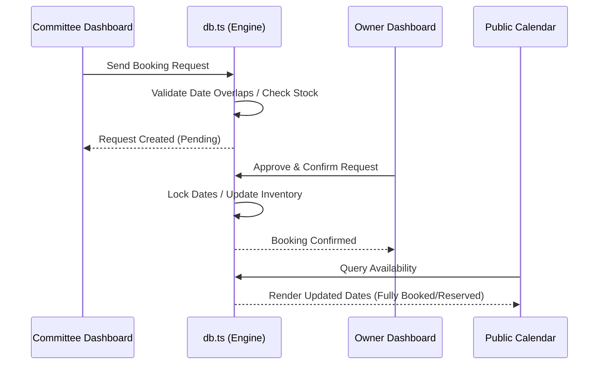

# 🐘 Kerala Pooram Management Portal (Pooram Connect)

Pooram Connect is a state-of-the-art, centralized digital ecosystem designed to streamline the planning, coordination, and execution of Kerala's iconic temple festivals (Poorams and Ulsavams). By bridging the gap between **Temple Festival Committees**, **Elephant Owners**, and **Traditional Accessory Owners**, the platform brings transparency, safety, and modern organizational efficiency to Kerala's rich cultural heritage.

---

## 🎨 Cultural Design System

The portal features a custom-designed, Kerala-heritage-inspired UI that integrates traditional color palettes and typography while supporting a responsive, smooth-transition theme engine.

### Core Design Tokens

All style rules and tokens are defined in [style.css](file:///D:/gvp%20codes/pooram-connect/src/style.css).

| Category | Token | Value | Description |
| :--- | :--- | :--- | :--- |
| **Colors (Heritage)** | `--maroon-primary` | `#800000` | Primary brand color, representing traditional festivity |
| | `--maroon-dark` | `#4A0000` | Darker maroon accents |
| | `--gold-primary` | `#D4AF37` | Majestic gold, mirroring the Nettipattam (ornaments) |
| | `--ivory-bg` | `#FAF6ED` | Classic ivory temple background |
| | `--deep-green` | `#1C3F24` | Forest green representing Kerala's natural landscapes |
| | `--dark-brown` | `#331A15` | Traditional wood tones |
| **Fonts** | `--font-title` | `'Playfair Display'` | Used for main headers |
| | `--font-accent` | `'Cinzel Decorative'` | Festive ornamental text elements |
| | `--font-body` | `'Plus Jakarta Sans'` | High-legibility modern body text |
| **Calendar Colors** | `--color-available` | `#2E7D32` | Green (Available) |
| | `--color-pending` | `#EF6C00` | Orange (Pending Request) |
| | `--color-booked` | `#C62828` | Red (Fully Booked) |

### 🌗 Light / Dark Theme Engine
The portal loads the active theme early using an inline script in [index.html](file:///D:/gvp%20codes/pooram-connect/index.html) to prevent styling flashes (FOUC). Theme toggling is handled dynamically inside [layout.ts](file:///D:/gvp%20codes/pooram-connect/src/components/layout.ts#L122-L131) and updates CSS custom properties under the `[data-theme="dark"]` selector.

---

## ⚙️ Core Architecture & Tech Stack



### 1. The SPA Regex Router
Rather than pulling in heavy external routing packages, the portal uses a fast, lightweight custom regex-based router implemented in [router.ts](file:///D:/gvp%20codes/pooram-connect/src/router.ts).
- **Route Registration**: Maps parameterized paths (like `/elephants/:id`) to render handlers using [addRoute](file:///D:/gvp%20codes/pooram-connect/src/router.ts#L12-L22).
- **History Sync**: Integrates with HTML5 `popstate` and intercepting link clicks via [initRouter](file:///D:/gvp%20codes/pooram-connect/src/router.ts#L55-L72) for smooth client-side transitions.
- **Dynamic Parameters**: Intercepts path variables and search query strings, passing them as key-value pairs directly to page render functions.

### 2. Client-Side Relational Database Engine
A client-side relational database wrapper in [db.ts](file:///D:/gvp%20codes/pooram-connect/src/db.ts) manages state on top of the browser's `localStorage`.
- **Database Seeding**: Populates initial, verified data from [dbSeed.ts](file:///D:/gvp%20codes/pooram-connect/src/dbSeed.ts) if no database is detected, or if a database version mismatch is triggered via the version-checking key.
- **Verification Gates**: Moderates elephants and accessory listings; items added by owners remain unverified until approved by an administrator.
- **Data Integrity**: Checks for table corruption on startup and restores standard states automatically.
- **Relational Tables**:
  - `users`: Authenticated user credentials and profiles.
  - `temples`: Temples mapped to committees.
  - `festivals`: Events scheduled by committees.
  - `elephants` & `accessories`: Resource directories available for booking.
  - `elephantBookings` & `accessoryBookings`: Logs of reservations.

### 3. Session & Authentication Middleware
The auth system in [auth.ts](file:///D:/gvp%20codes/pooram-connect/src/auth.ts) provides robust session management:
- **Hashing**: Simulates cryptography using a deterministic client-side [sha256](file:///D:/gvp%20codes/pooram-connect/src/db.ts#L122-L131) function for password verification.
- **State Events**: Emits `session-changed` events on login or logout, allowing navigation headers to immediately update without refreshing the window.
- **Role Verification**: Guards route loading and dashboard rendering using [checkRole](file:///D:/gvp%20codes/pooram-connect/src/auth.ts#L56-L61).

---

## 📅 Booking Workflows & Concurrency Control



### Elephant Booking Validation
Elephants are treated as single-occupancy resources. The booking engine enforces strict calendar conflicts:
1. When a booking request is made via [createElephantBooking](file:///D:/gvp%20codes/pooram-connect/src/db.ts#L370-L396), the system checks existing bookings.
2. If another booking for the same elephant overlaps the requested `startDate` and `endDate` with a status of `confirmed`, the transaction is blocked, throwing an error.
3. This overlap check is executed again upon owner confirmation in [updateElephantBookingStatus](file:///D:/gvp%20codes/pooram-connect/src/db.ts#L397-L420) to prevent double-bookings from concurrent pending requests.

### Accessory Inventory Stock Control
Pooram accessories (like Nettipattam, Chenda instruments, and decorative umbrellas) are treated as multi-quantity inventory assets. The booking engine validates availability date-by-date:
1. When a rental request is created, the system iterates day-by-day across the requested range.
2. For each date, it computes the sum of accessory quantities already committed in `confirmed` bookings.
3. If the currently rented amount plus the requested amount exceeds the accessory's `quantityTotal` on *any* day, the system throws an inventory exception, protecting owners from over-allocating stock.

---

## 👥 Portal Roles & Dashboards

The portal provides target-specific dashboards rendering custom views based on the logged-in user role:

### 1. Festival Committees (`committee`)
- **Temple Register**: Claim and manage temples in Kerala.
- **Festival Planner**: Post and edit festival timelines, schedules, descriptions, and media.
- **Resource Finder**: Search and filters verified elephants and accessories.
- **Booking Hub**: Dispatch reservation requests and monitor confirmation updates.

### 2. Elephant Owners (`elephant_owner`)
- **Elephant Register**: Add majestic elephants detailing age, height, mahouts, and history.
- **Verification Management**: Upload medical profiles and valid fitness certificates.
- **Request Desk**: Accept, reject, or mark requests as confirmed.

### 3. Accessory Owners (`accessory_owner`)
- **Rental Inventory**: Manage accessory listings, stock counts, descriptions, and day rental prices.
- **Rental Requests**: View pending items, verify quantities, and approve/reject bookings.

### 4. Administrator (`admin`)
- **Portal Oversight**: Manage temple and user approvals.
- **Moderator Console**: Approve or deny pending elephant and accessory profiles to guarantee site safety.
- **System Metrics**: Overview of overall user growth, booked resources, and festival schedules.

---

## 📂 Project Directory Structure

Below is the directory tree mapping the files of the project:

```
pooram-connect/
├── index.html                  # Main SPA entrypoint HTML
├── package.json                # Project dependencies and Vite build scripts
├── tsconfig.json               # TypeScript compiler options
├── vite.config.js              # Rollup bundling and path resolution configurations
└── src/
    ├── main.ts                 # App bootstrapping, route registry, & error boundaries
    ├── router.ts               # Regex routing engine and navigation click listener
    ├── db.ts                   # Relational database emulation & booking transaction validations
    ├── dbSeed.ts               # Core database initial seed data records
    ├── auth.ts                 # Session storage hooks & role authentication middleware
    ├── style.css               # Heritage-inspired design system stylesheet
    ├── components/
    │   ├── layout.ts           # Header, footer, theme buttons, & layout framework
    │   └── calendar.ts         # Stateful interactive booking calendar component
    └── views/
        ├── home.ts             # Hero carousel, featured listings, and landing layout
        ├── login.ts            # Secure user login portal
        ├── register.ts         # User registration form with role selection
        ├── festivals.ts        # Comprehensive festival calendar & district searches
        ├── elephants.ts        # Elephant directory, details page, and booking requests
        ├── accessories.ts      # Accessory rental shop, detail specifications, & bookings
        └── dashboard.ts        # Combined dashboard view for committees, owners, and admins
```

---

## 🚀 Developer Getting Started Guide

### Prerequisites
Make sure you have [Node.js](https://nodejs.org) installed on your system.

### Installation

1. Clone this repository to your local drive.
2. Open your terminal in the project directory and install the necessary dependencies:
   ```bash
   npm install
   ```

### Running Locally
Run the Vite development server locally:
```bash
npm run dev
```
The application will launch and be accessible at `http://localhost:5173`.

### Production Build & Bundling
To generate optimized production assets under `/dist`:
```bash
npm run build
```
To run the local preview server for the compiled distribution build:
```bash
npm run preview
```

> [!TIP]
> The database runs completely client-side. If you need to force-clean the state, you can clear your browser's local storage or click the **Reset Local Database & Reload** button on the error boundary overlay screen.

---

## 🔮 Future Enhancements
- **Secure Online Payments**: Integrated advanced escrow system for booking downpayments.
- **Real-Time GPS Tracking**: Track majestic elephants during festival processions for crowd safety.
- **Push Notification Hub**: SMS and browser alerts for committees and owners.
- **Offline Mode Capabilities**: Service worker caching for poor network environments during festivals.
- **Multi-language Localization**: Full Malayalam and English language toggles.
- **System Verification Badges**: Integration with state veterinary databases to verify elephant health certificates automatically.
